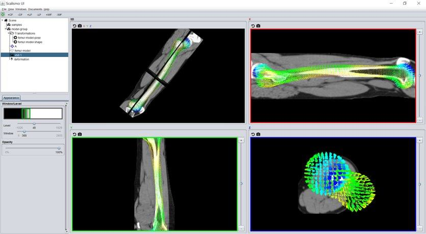

# Scalismo-ui [](https://travis-ci.org/unibas-gravis/scalismo-ui)

Scalismo-ui is a library for visualizing statistical shape models and related 3D objects, such as 3D meshes or 3D medical images. It is designed to complement the [Scalismo](https://github.com/unibas-gravis/scalismo) framework and to make it easy to build  graphical shape modelling applications and to allow for "visual debugging" of complex image analysis algorithms.
Further, it can be used as a standalone application for visualizing shape models, 3D meshes and 3D medical images.

Scalismo-ui was developed and is currently maintained by the [Graphics and Vision Research Group](http://gravis.cs.unibas.ch) of the [University of Basel](http://www.unibas.ch).




### Why

We believe that visualization is a key factor in the development of complex image analysis algorithm and that visual inspection is the most powerful debugging tool. But it is only used if visualization is simple to use. In Scalismo-ui, every object can be visualized by adding only one line of code:

```scala
val objectView = ui.show(group, object, "name of object")
```

It is equally simple to change the representation of the object, such as
in this example its color

```scala
objectView.color = Color.RED
```


# Usage

### Scalismo-ui as a library

Add the following dependency to your `build.sbt`:

```scala

resolvers += Resolver.bintrayRepo("unibas-gravis", "maven")

libraryDependencies += "ch.unibas.cs.gravis" %% "scalismo-ui" % "0.11.0"
```

The graphical user interface can be called from an application using the command
```
val ui = ScalismoUI()
```

### Standalone application
Scalismo-ui can also be used as a standalone application. Simply call
```
sbt run
```
to start the application. For more frequent use of scalismo-ui, it is convenient
to have the application available as a jar file. This can be built by calling

```
sbt assembly
```

The resulting jar file is ```target/scala-2.11/scalismo-ui.jar```


# Documentation

* [Quickstart guide](doc/quickstart.md)
* [API documentation](doc/api.md)
* [Plugin API](doc/plugins.md)


For questions regarding scalismo-ui or suggestions for improvements, please post to the mailing list [scalismo google group](https://groups.google.com/forum/#!forum/scalismo).


# Maintainers

* University of Basel, Graphics and Vision research: [@unibas-gravis](https://github.com/unibas-gravis), [homepage](http://gravis.cs.unibas.ch)
* Marcel Luethi, [@marcelluethi](https://github.com/marcelluethi)
* Ghazi Bouabene, [@ghazi-bouabene](https://github.com/ghazi-bouabene)


# Contributions

Contributions to scalismo-ui are very welceom. Please send us a pull request from your fork of this repository!
We do have to ask you to sign the [contributors agreement](contributors-agreement.pdf) before we can merge any of your work into our code base.

# Copyright and Licenses

All code is released under the GNU public license, available [here](https://opensource.org/licenses/GPL-3.0).

Copyright, University of Basel, 2017.
